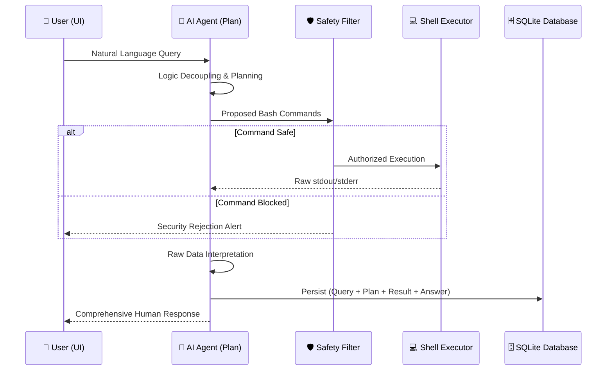

# 🎓 GhostShell AI: Educational Project Walkthrough

This document provides a comprehensive overview of the GhostShell AI architecture and its significance in modern cybersecurity and system administration.

---

## 1. Introduction
GhostShell AI represents a paradigm shift in system administration and cybersecurity operations by bridging the gap between natural language processing and kernel-level Linux control. Traditionally, managing complex Linux environments required deep command-line expertise and meticulous manual oversight. GhostShell leverages local Large Language Models (LLMs) to transform abstract human directives into precise, actionable system commands. By integrating a secure Flask backend with an immersive, glassmorphic frontend, the project provides a seamless interface for server diagnostics, penetration testing, and model management. It prioritizes privacy and security, ensuring that sensitive operational data remains entirely within the user's controlled environment.

## 2. Abstract
This project introduces GhostShell, an AI-powered co-pilot designed for automated Linux administration. Utilizing local LLMs via Ollama, GhostShell interprets natural language queries, generates bash plans, and executes them over secure channels. The system features a Single Page Application (SPA) architecture with dedicated modules for Kali tool management and LLM orchestration. With a persistent SQLite backend, it maintains session context and interaction logs, serving as both a real-time operative tool and a data source for future AI fine-tuning.

## 3. Existing System & Features
*   **Manual CLI Dependency**: Traditional administration relies heavily on the user’s memory of complex syntax, flags, and nested command structures.
*   **Stateless Operation**: Standard terminal sessions lack integrated reasoning and don't provide context-aware interpretations of raw error codes or system logs.
*   **Fragmented Tooling**: Security scanning, server management, and model orchestration usually exist in disconnected environments, requiring manual context switching.
*   **Volatile Logging**: Command history is often stored in basic text files (`.bash_history`) without associated natural language intent, reasoning context, or outcome analysis.

## 4. Proposed System & Features
*   **Natural Language Orchestration**: Translates descriptive intent (e.g., "Find large logs") into multi-step execution plans with kernel-safe validation.
*   **Persistent Interaction Layer**: Integrates a dedicated SQLite storage engine to save long-term session context, command results, and LLM reasoning cycles.
*   **Unified Security Dashboard**: A single glassmorphic SPA interface combining real-time Chat, Kali Tool Scanning (Arsenal), and LLM Model Management.
*   **Local AI Privacy**: Operates entirely with local models (llama3.1), ensuring that sensitive operational data never leaves the air-gapped or local network.

## 5. Workflow of this Project

The GhostShell system operates on a high-speed, iterative **Plan-Execute-Interpret** cycle. The following diagram and detailed breakdown explain the data flow from user input to persistent storage.

### 🔄 Data Flow Architecture

### 🧩 Phase Breakdown

1.  **Query Input & Context Retrieval**: The user submits a directive via the Glassmorphic UI. The system immediately retrieves previous session context from the SQLite database to maintain conversational "memory."
2.  **Intent Planning (Cognitive Layer)**: The local LLM (LLaMa 3.1) processes the input. It doesn't just "guess"—it builds a structured JSON execution plan defining exactly which Linux utilities are needed to solve the problem.
3.  **Safety Verification (Security Layer)**: Before reaching the shell, every proposed command passes through a `hard_block` regex engine. This prevents accidental execution of dangerous commands like `rm -rf /` or unauthorized file deletions.
4.  **Native/Remote Execution**: Authorized commands are dispatched via `subprocess` (local) or `Paramiko` (SSH). The system captures the raw, unfiltered output from the operating system kernel.
5.  **Output Interpretation (Human Layer)**: The raw terminal data is fed back into the LLMs. The AI "reads" the logs, identifies errors or successes, and translates technical jargon into plain, actionable advice.
6.  **Immutable Persistence**: Every step of the thought process and the final outcome is logged into `ghostshell.db`. This ensures the project creates a continuous learning loop where past actions can inform future decisions.

## 6. Conclusion
GhostShell AI successfully demonstrates the potential of integrating local Large Language Models into the Linux operational workflow. By combining intelligent command generation with a persistent data layer and a modern web interface, it lowers the barrier to entry for complex system administration while enhancing security reporting. As a scalable framework, GhostShell paves the way for autonomous, self-learning security agents that can adapt to changing environments through locally documented experience and logged interactions.

## 7. Reference
*   **Ollama API Documentation**: Used for local LLM deployment and OpenAI-compatible orchestration.
*   **Flask Framework**: The core backend technology for building the RESTful API and serving the SPA.
*   **Paramiko SSH Library**: Implements secure communication and remote command execution on target servers.
*   **SQLite3 Specifications**: Provides the relational data persistence for session management and context retention.
*   **Kali Linux Toolkit**: The primary reference for the "Kali Arsenal" automated asset enumeration module.

## 8. Future Development
*   **Fine-Tuning Integration**: Automatically using the saved SQLite data to train lightweight models specifically on your server's unique quirks.
*   **Autonomous Patching**: Enabling the agent to not only identify but also automatically remediate security vulnerabilities found during scans.
*   **Multi-Agent Collaboration**: Introducing specialized agents for different security domains (e.g., a "Forensics Agent" vs a "Red Team Agent").
*   **Voice Control Integration**: Implementing hands-free server management via advanced local Speech-to-Text and Wake-Word processing.
*   **Real-time Network Mapping**: Dynamic graph visualization based on automated Nmap discoveries within the central dashboard.
