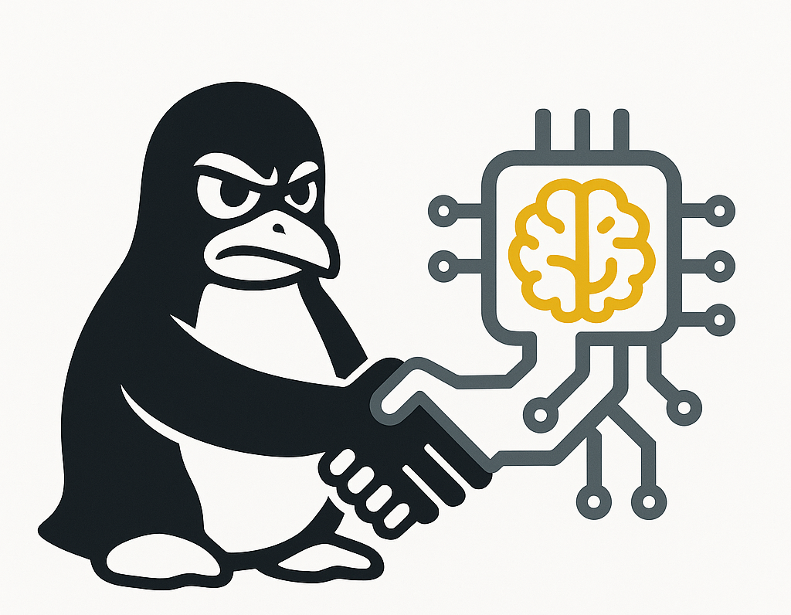

<div align="center">
  
  
  <h1>👻 GhostShell AI</h1>
  <p><strong>Natural language → Kernel-level Linux control via LLMs</strong></p>

  <p>
    <a href="#features">Features</a> •
    <a href="#architecture">Architecture</a> •
    <a href="#installation">Installation</a> •
    <a href="#usage">Usage</a>
  </p>
</div>

---

**GhostShell AI** is an advanced AI-powered Linux Co-Pilot and Administration Dashboard. It allows you to interpret, diagnose, and execute administrative commands on remote Linux servers via a beautiful, hacker-themed, glassmorphic Single Page Application (SPA). By leveraging local LLMs (like LLaMa 3.1 via Ollama), your operational data never leaves your environment.

## ✨ Features

*   **Natural Language Execution**: Type plain English. GhostShell plans the right bash commands, executes them on your machine, and interprets the kernel-level output securely.
*   **Multi-Page SPA Dashboard**: 
    *   **💬 Co-Pilot Terminal**: Interactive terminal hooked to the LLM agent.
    *   **🧠 Local LLM Manager**: Dynamically list, inspect, and delete local models hosted on Ollama directly from the UI.
    *   **🗡️ Kali Arsenal Scanner**: Enumerate and interact with graphical penetration testing assets installed on the target machine.
*   **Intelligent Safety Filter**: Employs a strict RegEx-based safety filter to hard-block potentially destructive commands (`rm -rf`, `dd`, etc.) before they hit the executor.
*   **Seamless Reverse Tunnels**: Effortlessly connect your local Windows desktop to headless remote VMs (using tools like `ngrok`) dynamically—no manual routing required.

---

## 🏗️ Architecture Design

GhostShell utilizes a robust Server-Client isolation approach.

### LLM ↔ Linux Agent Request Flow
When a user asks a question, the Agent automatically decides the correct series of system-level bash commands required to fulfill the request, executes them, parses raw stdout/stderr, and returns a human-readable interpretation.

<div align="center">
  <!-- NOTE: Save the provided diagram image in your directory as 'architecture_flow.png' -->
  
</div>

### VPS Connection Architecture
The dashboard can be operated from anywhere (Mobile, Desktop) via HTTPS. The Flask API proxies these natural language directives into the LLM Agent, which translates and natively interfaces with the Linux kernel via `subprocess` or `ssh`.

<div align="center">
  <!-- NOTE: Save the provided diagram image in your directory as 'architecture_vps.png' -->
  
</div>

---

## 🚀 Quick Start

### 1. Install Dependencies
```bash
git clone https://github.com/yourusername/ghostshell.git
cd ghostshell
pip install -r requirements.txt
```

### 2. Configure `.env`
Create or modify your `.env` file to set up your LLM endpoints and SSH keys:

```env
# Ollama Configuration
OLLAMA_BASE_URL=http://127.0.0.1:11434/v1
LLM_MODEL=llama3.1:latest

# Execution mode ('local' or 'ssh')
EXECUTION_MODE=ssh        

# SSH Settings (For target execution)
SSH_HOST=127.0.0.1
SSH_PORT=22
SSH_USER=root
SSH_PASSWORD=your-secure-password
```

### 3. Launch the Server
```bash
python ghostshell.py
```
> The dashboard will immediately be available at `http://127.0.0.1:5000`.

### 4. Deploying the Remote Reverse Agent (Optional)
If tunneling into a remote Kali instance heavily guarded by NAT run the `kali_agent.py` on the target machine:
```bash
python3 kali_agent.py --ngrok-token <YOUR_TOKEN> --ghostshell <YOUR_FLASK_HOST>:5000
```
This automatically updates the parent GhostShell instance with the fresh IP and Port payload.

---

## 💻 Tech Stack

*   **Backend**: Python 3.10+, Flask, Paramiko (for SSH ops), Requests
*   **LLM Engine**: Ollama (OpenWebUI API spec)
*   **Frontend**: Vanilla HTML5, JavaScript (SPA Router), Custom CSS (Glassmorphism + Phosphor aesthetics)

---

## ⚠️ Security Notice
This project interfaces directly with Linux Kernel configurations and executes root-level commands dynamically generated by an LLM. While `hard_block` safety rules are in place in `executor.py`, **DO NOT** run GhostShell against mission-critical production servers without container isolation or strict IAM parameters.

---
<div align="center">
  <i>Built for Easy Usability</i>
</div>
